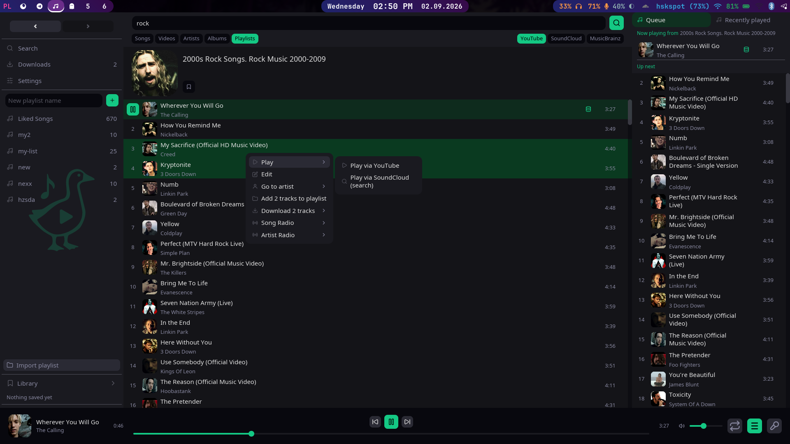

# GooseOb's Music Player



A YouTube/SoundCloud/Bandcamp search music player with local playback, downloads, and OS media controls, built with [iced](https://iced.rs).

## Features

- **Search** — YouTube Music (Songs / Videos / Artists / Albums / Playlists) via ytmusicapi with yt-dlp fallback, plus SoundCloud, Bandcamp, Last.fm (built-in app key), and MusicBrainz search. Drill
  into artists, albums, and playlists.
- **Streaming & caching** — Stream audio via yt-dlp (YouTube/SoundCloud) or direct HTTP (Bandcamp), with fully native decoding, cached to disk for instant replay.
- **Downloads** — Download tracks to MP3 via yt-dlp, with a Downloads view and on-row indicators.
- **Local music & playlists** — Add local files (MP3, FLAC, WAV, OGG, M4A, AAC, OPUS, WMA) and create, rename, delete, and organize playlists.
- **Library** — Save albums, artists, and playlists; browse them from the sidebar.
- **Artist pages** — Header with stats plus Most popular, Albums, Playlists, and Fans-also-like sections, each with its own provider picker.
- **Radio** — Song radio and artist radio from search results.
- **Queue** — Queue panel with Up Next and Recently Played tabs.
- **Split panes** — Split the main view with <kbd>\</kbd> (side by side) or <kbd>Shift</kbd>+<kbd>\</kbd> (stacked), up to 4 panes. Each pane has its own search bar, navigation history, and lyrics view; sidebar clicks and keyboard shortcuts target the focused pane (click any pane to focus it). Close a pane from its header or with <kbd>Ctrl</kbd>+<kbd>W</kbd>.
- **Drag & drop** — Drag tracks between views, into the queue, onto playlists (reorder or turn a card into a local playlist), and into the
  Library.
- **Lyrics** — Free, no-key LRCLib lyrics with synced lines that seek on click; cached per track. Add your own named custom lyrics per track (plain or `[mm:ss.xx]`-synced) — they appear as tabs next to the providers, editable and deletable from the lyrics view. Attach multi-line notes to any custom line with `#` comment lines; the active line's note shows in an editable block below the lyrics.
- **Media controls** — OS media keys / MPRIS (Linux) / SMTC (Windows) / Now Playing (macOS) via souvlaki.
- **More** — Search history, volume normalization, navigation history, session restore, right-click context menu, dark theme.
- **Localization** — 13 languages: English, Polski, Español, Português (Brasil), 简体中文, العربية, Беларуская, Français, Deutsch, 日本語, Русский, हिन्दी, Українська.

## Installation

### Quick install (Linux / macOS)

```sh
curl -fsSL https://raw.githubusercontent.com/GooseOb/music_plr/master/scripts/install.sh | bash
```

Detects your platform, downloads the latest release, and installs everything. On Linux it also sets up the desktop entry and icon.

### Windows

Download the [latest release](https://github.com/GooseOb/music_plr/releases/latest/download/goosemusic-x86_64-pc-windows-msvc.zip) and extract to a folder. Run `goosemusic.exe`.

### Manual install

Download from [GitHub releases](https://github.com/GooseOb/music_plr/releases) or compile from source:

```sh
cargo install goosemusic
```

#### Linux desktop integration

The release tarball includes a `.desktop` file and icon. After extracting:

```sh
cp goosemusic ~/.local/bin/
cp goosemusic.desktop ~/.local/share/applications/
cp icons/logo.svg ~/.local/share/icons/goosemusic.svg
```

#### macOS

Extract the `.app.tar.gz` and drag `Goosemusic.app` to your Applications folder. On first open, right-click → Open if macOS blocks it (unsigned app).

## Supported languages

| Language                       | Code    |
| ------------------------------ | ------- |
| English                        | `en`    |
| Polski (Polish)                | `pl`    |
| Español (Spanish)              | `es`    |
| Português (Brasil)             | `pt_br` |
| 简体中文 (Chinese, Simplified) | `zh_cn` |
| العربية (Arabic)               | `ar`    |
| Беларуская (Belarusian)        | `be`    |
| Français (French)              | `fr`    |
| Deutsch (German)               | `de`    |
| 日本語 (Japanese)              | `ja`    |
| Русский (Russian)              | `ru`    |
| हिन्दी (Hindi)                 | `hi`    |
| Українська (Ukrainian)         | `uk`    |

Pick a language from the in-app **Settings** view. To add one, copy `src/i18n/en.rs` to a new module, translate the strings, and append one entry
to the `languages!` macro in `src/i18n/mod.rs` — the `Language` enum and picker are generated from that list.

## Install & run

**Prerequisites**

- **Rust** (stable, edition 2021)
- **yt-dlp** — YouTube audio streaming and downloads
- **Python 3** + `ytmusicapi` — YouTube Music search (optional; falls back to yt-dlp)
- **D-Bus** session bus (Linux) — for MPRIS
- Network access — lyrics fetch live from [LRCLib](https://lrclib.net) (no key)

```sh
cargo build
cargo run
```

## Keyboard shortcuts

| Key                                                                 | Action                                                                           |
| ------------------------------------------------------------------- | -------------------------------------------------------------------------------- |
| <kbd>Space</kbd>                                                    | Toggle play/pause                                                                |
| <kbd>Esc</kbd>                                                      | Close in-list search → close search history → clear selection → return to Search |
| <kbd>Delete</kbd>                                                   | Delete selected tracks (playlist view only)                                      |
| <kbd>←</kbd>/<kbd>→</kbd> or <kbd>h</kbd>/<kbd>l</kbd>            | Move focus between queue panel and track list                                    |
| <kbd>↑</kbd>/<kbd>↓</kbd> or <kbd>k</kbd>/<kbd>j</kbd>              | Move through the focused list (auto-scrolls, wraps)                              |
| <kbd>gg</kbd> / <kbd>G</kbd>, <kbd>Home</kbd>/<kbd>End</kbd>        | First / last row                                                                 |
| <kbd>PgUp</kbd>/<kbd>PgDn</kbd>, <kbd>Ctrl</kbd>+<kbd>U</kbd>/<kbd>D</kbd> | Page / half-page                                                               |
| <kbd>Shift</kbd>+<kbd>↑</kbd>/<kbd>↓</kbd> (<kbd>J</kbd>/<kbd>K</kbd>), <kbd>Ctrl</kbd>+<kbd>Space</kbd> | Extend selection / toggle selection on focused row        |
| <kbd>Ctrl</kbd>+<kbd>F</kbd>                                        | In-list fuzzy search over the hovered track list (<kbd>n</kbd>/<kbd>p</kbd> step matches) |
| <kbd>Enter</kbd>                                                    | Play the focused (or hovered) track                                              |
| <kbd>Ctrl</kbd>+<kbd>C</kbd> / <kbd>Ctrl</kbd>+<kbd>V</kbd>         | Copy / paste selected tracks                                                     |
| <kbd>Ctrl</kbd>+<kbd>A</kbd>                                        | Select all tracks in the focused list                                            |
| <kbd>Alt</kbd>+<kbd>P</kbd> / <kbd>Alt</kbd>+<kbd>1..5</kbd>, <kbd>Alt</kbd>+<kbd>S</kbd> | Stage search provider / scope (pending until <kbd>Enter</kbd>)     |
| <kbd>Alt</kbd>+<kbd>Enter</kbd>                                     | Run the pending search from anywhere                                             |
| <kbd>Alt</kbd>+<kbd>↑</kbd>/<kbd>↓</kbd>, <kbd>Ctrl</kbd>+<kbd>K</kbd> | Prev/next playlist, playlist jumper (<kbd>Enter</kbd> open, <kbd>Shift</kbd>+<kbd>Enter</kbd> play) |
| <kbd>Alt</kbd>+<kbd>←</kbd>/<kbd>→</kbd>                            | Back / forward in the focused pane                                               |
| <kbd>N</kbd> / <kbd>P</kbd>                                         | Next / previous track                                                            |
| <kbd>Q</kbd> / <kbd>R</kbd> / <kbd>Shift</kbd>+<kbd>L</kbd>         | Toggle queue / repeat / lyrics                                                   |
| <kbd>T</kbd>                                                           | Switch queue panel tab: Queue ↔ Recently Played (opens panel if hidden)          |
| <kbd>M</kbd>, <kbd>-</kbd>/<kbd>=</kbd>, <kbd>,</kbd>/<kbd>.</kbd>  | Mute, volume, seek ∓5s (<kbd>Shift</kbd> ∓10s)                                    |
| <kbd>\</kbd> / <kbd>Shift</kbd>+<kbd>\</kbd>                        | Split focused pane side by side / stacked                                        |
| <kbd>Ctrl</kbd>+<kbd>W</kbd>                                        | Close the focused pane                                                           |
| <kbd>Ctrl</kbd>+<kbd>←</kbd>/<kbd>→</kbd>/<kbd>↑</kbd>/<kbd>↓</kbd> | Move focus to the adjacent pane                                                  |
| <kbd>Ctrl</kbd>+<kbd>Tab</kbd>, <kbd>Ctrl</kbd>+<kbd>1..4</kbd>     | Cycle / jump between panes                                                       |
| <kbd>?</kbd> / <kbd>F1</kbd>                                           | Show this cheatsheet in-app                                                      |

## Configuration

Config lives at `~/.config/goosemusic/config.json` and is also editable live from the in-app **Settings** view.

| Field                        | Description                                               | Default              |
| ---------------------------- | --------------------------------------------------------- | -------------------- |
| `download_dir`               | Download directory                                        | `~/Music/goosemusic` |
| `cache_max_size_mb`          | Max stream cache size (MB)                                | `1024`               |
| `max_search_history_stored`  | Search history entries kept on disk                       | `100`                |
| `max_search_history_visible` | Entries shown in the dropdown                             | `10`                 |
| `max_recently_played`        | Tracks kept in Recently Played                            | `50`                 |
| `volume_normalization`       | Consistent loudness across tracks                         | `false`              |
| `cookie_browser`             | Browser yt-dlp reads cookies from (age-restricted videos) | `none`               |

Persistent data goes to `~/.local/share/goosemusic` (playlists, library, downloads, search history); regenerable caches (session, streamed audio,
thumbnails, lyrics) go to `~/.cache/goosemusic`.

## Technical notes

**State** — All state lives in one `MusicPlayer`; `view()` is a pure function of `&MusicPlayer`. Background work (search, download, thumbnails)
returns via an mpsc channel drained by a 250ms tick. Stores implement a `JsonStore` trait and degrade to defaults on failure.

**Audio** — A dedicated output thread runs the rodio sink. yt-dlp streams AAC-in-M4A into a still-growing cache file; a custom
`SymphoniaStreamingSource` over a non-seekable `GrowingMediaSource` decodes sequentially so playback starts within a few KB.
Cached/downloaded/local files use the same source in seekable mode. Per-track normalization gain is computed once (symphonia) and applied on
replay.

## License

MIT
